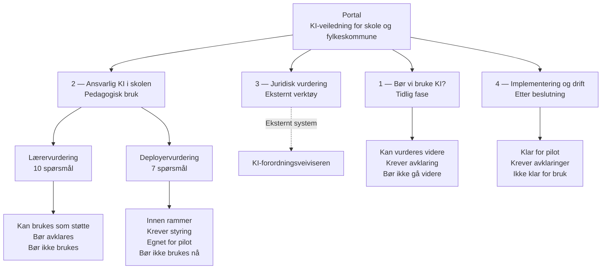

# Arkitektur

Beskriver systemets oppbygning og flyt.

---

## Oversikt

Systemet er et statisk veiledningssystem uten server eller database.
Det består av en portal og fire separate moduler.

Alle vurderinger skjer lokalt i nettleseren. Ingen data lagres eller sendes.

---

## Moduler

| Modul | Plassering | Formål |
|---|---|---|
| Portal | `index.html` | Oversikt og navigasjon |
| Bør vi bruke KI? | `bor-vi-bruke/` | Tidligfasevurdering |
| Ansvarlig KI i skolen | `app.js` + `index.html` (root) | Lærer- og deployervurdering |
| Implementering og drift | `implementering/` | Gjennomføring og styring |
| Juridisk vurdering | Eksternt | KI-forordningsvurdering |

---

## Flytdiagram

---

## Prosesskjede

Den anbefalte rekkefølgen er:

1. **Bør vi bruke KI?** — Er det grunnlag for å gå videre?
2. **Ansvarlig KI i skolen** — Vurder ansvarlig bruk i praksis
3. **Juridisk vurdering** — Vurder klassifisering etter KI-forordningen (der relevant)
4. **Implementering og drift** — Planlegg gjennomføring og oppfølging

Rekkefølgen er veiledende. Juridisk vurdering er alltid uavhengig og parallell — den gjennomføres i et eget verktøy.

---

## Prinsipper

| Prinsipp | Forklaring |
|---|---|
| Menneskelig beslutning er alltid siste ledd | Verktøyene fatter ingen beslutninger |
| Lærer er aldri deployer | Rollene er separate og stiller ulike krav |
| Pilot er et styringsgrep | Ikke en risikoreduksjon eller «prøv og se» |
| KI-kompetanse er en forutsetning | Ikke noe som kan utsettes til etter implementering |
| Ingen juridiske konklusjoner | Juridisk vurdering skjer i egne verktøy |
| Vurderingsutfall ≠ tillatelse | Et grønt utfall er ikke en godkjenning |

---

## Teknisk

- Statisk HTML, CSS og JavaScript — ingen rammeverk
- Ingen server, ingen database, ingen lagring av data
- Kjører i nettleser uten installasjon
- Hostes på GitHub Pages fra `portal-fix`-branchen
